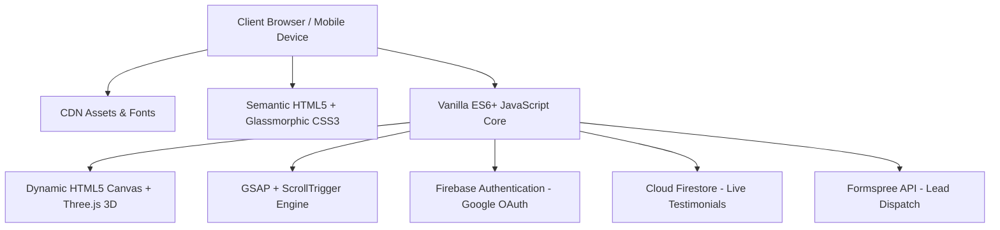

<div align="center">

  # 🌟 Muhammad Irfan Waseem
  ### 🚀 Modern Glassmorphic Developer Portfolio & 3D Showcase

  <p align="center">
    <strong>Crafting Intelligent Cross-Platform Mobile Applications, Full-Stack Web Ecosystems & AI Solutions</strong>
  </p>

  <!-- Badges -->
  <p align="center">
    <a href="https://ir786106.github.io/Muhammad_Irfan_Waseem_Portfolio/">
      
    </a>
    <a href="https://github.com/Ir786106">
      
    </a>
    <a href="https://linkedin.com/in/muhammad-irfan-wasee-48226b297">
      
    </a>
    <a href="LICENSE">
      
    </a>
  </p>

  <!-- Tech Badges Strip -->
  <p align="center">
    
    
    
    
    
    
    
    
    
    
  </p>

  <p align="center">
    <a href="#-about-the-portfolio">📖 About</a> •
    <a href="#-key-features">✨ Features</a> •
    <a href="#-featured-projects">💼 Projects</a> •
    <a href="#%EF%B8%8F-tech-stack--architecture">🛠️ Tech Stack</a> •
    <a href="#-responsive-engineering">📱 Responsive</a> •
    <a href="#-quick-start">🚀 Quick Start</a> •
    <a href="#-contact--connect">📬 Contact</a>
  </p>

</div>

---

## 💡 About The Portfolio

> *"Turning Ideas into Intelligent Solutions."*

Welcome to the official repository of **Muhammad Irfan Waseem's Developer Portfolio**. Built from the ground up with high-performance vanilla web standards, this portfolio provides an immersive experience showcasing cutting-edge engineering across **Mobile Development (Flutter & React Native)**, **Full-Stack Web Architectures (MERN & FastAPI)**, **AI Integrations (Gemini & MediaPipe)**, and **Cybersecurity**.

Designed with a sleek **Cyber Glassmorphism** aesthetic, interactive Three.js 3D viewport, hardware-accelerated GSAP timelines, and a live Firebase feedback engine.

---

## ✨ Key Features

| Category | Icon | Feature Highlight | Technical Details |
| :--- | :---: | :--- | :--- |
| **Theme Engine** | 🌓 | **Dual Cyber / Prism Theme** | Seamless switching between *Dark Cyber Luminescence* and *Light Architectural Prism* with persistent `localStorage` and theme-aware canvas. |
| **Mobile Drawer** | 📱 | **Engineered Responsive Drawer** | Compact slide-in navigation drawer with backdrop blur, touch-optimized targets (44×44px), keyboard focus trap, and safe-area insets. |
| **3D Graphics** | 🌀 | **Interactive Three.js Canvas** | Interactive geometry and particle cloud responding in real-time to cursor coordinates with 60 FPS performance. |
| **Micro-Animations** | ⚡ | **GSAP & ScrollTrigger** | Smooth section reveals, typing terminal emulation, magnetic hover effects, and continuous progress tracking. |
| **Live Database** | 🔥 | **Firebase Live Reviews** | Google OAuth 2.0 authentication and Cloud Firestore integration allowing verified visitors to post and edit ratings in real time. |
| **Contact Routing** | 📬 | **Formspree & Lead Capture** | Real-time validated contact form with asynchronous AJAX submission and failover toast notifications. |
| **Local Runtime** | 💻 | **Zero-Dependency Dev Server** | Built-in lightweight Node.js static server (`serve.js`) with complete MIME streaming and clean URL routing. |
| **Performance** | 🚀 | **Lightweight & High Speed** | Zero heavy client frameworks, minimal bundle payload, native DOM manipulation, and deferred asset loading. |

---

## 💼 Featured Projects

A curated showcase of shipped platforms, mobile applications, and software engineering initiatives:

| Project | Domain | Stack | Overview |
| :--- | :---: | :--- | :--- |
| 🤖 **InterviewMate AI Pro** | AI & Web | `MERN` `FastAPI` `Gemini AI` `MediaPipe` | 6-stage intelligent interview evaluation suite with real-time audio/video facial analytics, scoring, and automated candidate summaries. |
| 🍔 **Food Fight** | Mobile App | `Flutter` `Firebase` `Google Maps API` `FCM` | Complete multi-role restaurant ecosystem featuring real-time order tracking, live courier GPS routing, and instant admin management. |
| 🚚 **TarseelX** | Logistics | `React Native` `Expo` `Firebase` | Nationwide freight and cargo logistics network connecting corporate shippers with vetted logistics carriers across Pakistan. |
| 🌾 **Mandi Pro ERP** | Enterprise | `Flutter` `Dart` `Firebase` `Cloud Sync` | Cross-platform ERP digitizing grain market inventories, commission ledgers, automated daily accounts, and redundant cloud backups. |
| 🏢 **Ittihad Food App** | Enterprise | `Flutter` `Firebase Realtime` `Supabase` | Industrial-grade inventory and warehouse management app featuring real-time stock sync, role-based access, and audit trails. |
| 🛒 **Saqib Shop POS** | Retail POS | `Flutter` `Dart` `SQLite` | Custom Point of Sale and digital ledger platform designed for rapid barcode scanning, stock tracking, and financial bookkeeping. |
| 🏨 **Hotel Management** | Desktop | `Java` `Swing` `MySQL` `JDBC` | Modular desktop ERP managing room bookings, customer billing, amenities billing, and financial audit logs. |
| 🛡️ **VeilGuard SecJournal**| InfoSec | `Blogger` `Cybersecurity` `Threat Intel` | Technical cybersecurity knowledge base publishing deep-dives on zero-day vulnerabilities, network defense, and system auditing. |

---

## 🛠️ Tech Stack & Architecture



### 🎨 Frontend & Design System
* **HTML5:** Semantic markup, accessibility attributes (`ARIA`, roles, tab-indexing), optimized meta tags.
* **CSS3 Architecture:** Custom variables (`:root`), Flexbox, CSS Grid, Glassmorphism backdrop-filters, custom responsive breakpoints.
* **Typography:** Google Fonts (`Space Grotesk`, `Outfit`, `Fira Code`).
* **Iconography:** FontAwesome 6.5.0 Pro Icons.

### ⚙️ Scripting & Libraries
* **JavaScript:** Modern Vanilla ES6+ (Async/Await, IntersectionObserver, MutationObserver, Event Delegation).
* **3D Engine:** [Three.js](https://threejs.org/) for real-time 3D viewport rendering.
* **Animation:** [GSAP (GreenSock)](https://greensock.com/) & ScrollTrigger for timeline sequences.

### ☁️ Cloud & Backend Services
* **Database:** Google Cloud Firestore (NoSQL, real-time listener snapshots).
* **Authentication:** Google Firebase Auth (Popup OAuth 2.0).
* **API Delivery:** Formspree Contact Form Endpoint.
* **Hosting:** GitHub Pages & Firebase Hosting compatible.

---

## 📱 Responsive Engineering

The portfolio layout is precision-tuned across all device form factors:

```
[ 320px - 374px ] Small Mobile    -> Compact 260px Drawer, 60px Page Margin Visible
[ 375px - 480px ] Standard Mobile -> Fluid clamp(275px, 78vw, 305px) Drawer + Backdrop
[ 481px - 899px ] Large / Tablet  -> 330px Drawer with Accessible 44px Controls
[ 900px +       ] Desktop         -> Full Glassmorphic Top Navbar & Inline Controls
```

* 🛡️ **Safe Area Support:** Integrated `env(safe-area-inset-top)` and `env(safe-area-inset-bottom)`.
* 🔒 **Focus Lock & Esc Dismiss:** Accessible keyboard interaction inside modal sheets.
* 🚫 **No Horizontal Overflow:** GPU-accelerated transforms (`translateX`) preventing viewport shifts.

---

## 📂 Repository Directory Structure

```text
Muhammad_Irfan_Waseem_Portfolio/
├── 📄 .firebaserc              # Firebase project environment mapping
├── 📄 .gitignore               # Comprehensive Git ignore rules (OS, editor, build)
├── 📄 404.html                 # Interactive cyber-themed 404 error page
├── 📄 firebase.json            # Firebase Hosting configuration & headers
├── 📄 index.html               # Main portfolio landing page & accessible modals
├── 📄 LICENSE                  # MIT Open-Source License
├── 📄 README.md                # Comprehensive project documentation
├── 📄 script.js                # Core interactive logic, animations & Firebase bridge
├── 📄 serve.js                 # Zero-dependency local Node.js development server
├── 📄 style.css                # Master design system, variables & responsive rules
│
└── 📁 Images/                  # Graphic assets, certificates & profile media
    ├── 🖼️ 1.jpg ... 7.png      # High-resolution project screenshots
    ├── 👤 Irfan.jpg            # Author profile photograph (Hi-Res)
    ├── 👤 Irfan.webp           # WebP compressed avatar for instant load
    ├── 📑 Irfan_Resume.pdf     # Downloadable developer curriculum vitae
    ├── 🎨 logo.svg             # Scalable vector brand identity
    ├── 📜 cert-*.jpg           # Official certificates (Nexa, COMSATS, Workshops)
    └── 📁 LinkedIn/            # Recommendation banners & credential assets
```

---

## 🚀 Quick Start (Local Setup)

### 📋 Prerequisites
* A modern web browser ([Google Chrome](https://www.google.com/chrome/), [Firefox](https://www.mozilla.org/firefox/), [Edge](https://www.microsoft.com/edge/))
* Optional: [Node.js](https://nodejs.org/) (v16.0+ recommended)

### 1️⃣ Clone the Repository
```bash
git clone https://github.com/Ir786106/Muhammad_Irfan_Waseem_Portfolio.git
cd Muhammad_Irfan_Waseem_Portfolio
```

### 2️⃣ Launch the Local Server

#### ⚡ Option A: Using Built-in Node.js Server (Zero Dependencies)
```bash
node serve.js
```
> Server live at: `http://localhost:8080`

#### 🌐 Option B: Using VS Code Live Server
1. Open the project folder in **Visual Studio Code**.
2. Install the **Live Server** extension (`ritwickdey.liveserver`).
3. Click **"Go Live"** in the bottom status bar.

#### 📂 Option C: Direct Browser Launch
Open `index.html` directly in any web browser.

---

## 🏆 Honors & Credentials

* 🥈 **CSDS '26 Runner Up** — COMSATS Software Development Showcase
* 💼 **Devsphere Software Engineering Intern** — Credential ID: `DVS-7027`
* 🛡️ **Cybersecurity Analyst Certification** — Nexa Security Architecture Fundamentals
* 🤖 **AI Engineering & LLM Automation** — Advanced Hands-on AI Agent Workflows

---

## 📬 Contact & Connect

<div align="center">

| Channel | Link | Handle / Destination |
| :--- | :--- | :--- |
| 🌐 **Live Website** | [Portfolio Site](https://ir786106.github.io/Muhammad_Irfan_Waseem_Portfolio/) | `ir786106.github.io` |
| 💻 **GitHub** | [github.com/Ir786106](https://github.com/Ir786106) | `@Ir786106` |
| 🔗 **LinkedIn** | [linkedin.com/in/muhammad-irfan-wasee-48226b297](https://linkedin.com/in/muhammad-irfan-wasee-48226b297) | `Muhammad Irfan Waseem` |
| 🐦 **Twitter / X** | [twitter.com/Irfan_CyberSec](https://x.com/Irfan_CyberSec) | `@Irfan_CyberSec` |
| 🛡️ **Tech Blog** | [VeilGuard SecJournal](https://veilguardsecjournal.blogspot.com) | `VeilGuard Blog` |
| 📧 **Direct Email** | [muhammadirfan.infosec@gmail.com](mailto:muhammadirfan.infosec@gmail.com) | `muhammadirfan.infosec@gmail.com` |

<br>

**⭐ If you like this portfolio, please give this repository a star! ⭐**

</div>

---

## 📄 License

Distributed under the **MIT License**. See [`LICENSE`](LICENSE) for complete terms and details.

<div align="center">
  <sub>Designed & Developed with ❤️ by <strong>Muhammad Irfan Waseem</strong> • Built for speed, elegance, and scale.</sub>
</div>
